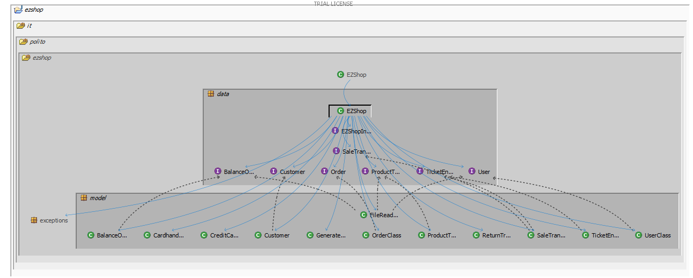

# Design assessment


```
<The goal of this document is to analyse the structure of your project, compare it with the design delivered
on April 30, discuss whether the design could be improved>
```

# Levelized structure map
```
<Applying Structure 101 to your project, version to be delivered on june 4, produce the Levelized structure map,
with all elements explosed, all dependencies, NO tangles; and report it here as a picture>
```


# Structural over complexity chart
```
<Applying Structure 101 to your project, version to be delivered on june 4, produce the structural over complexity chart; and report it here as a picture>
```


# Size metrics

```
<Report here the metrics about the size of your project, collected using Structure 101>
```


| Metric                                    | Measure |
| ----------------------------------------- | ------- |
| Packages                                  |    6     |
| Classes (outer)                           |    41     |
| Classes (all)                             |    41     |
| NI (number of bytecode instructions)      |   7428      |
| LOC (non comment non blank lines of code) |   ~3194      |


# Items with XS

```
<Report here information about code tangles and fat packages>
```

| Item | Tangled | Fat  | Size | XS   |
| ---- | ------- | ---- | ---- | ---- |
| ezshop.it.polto.ezshop     |     5.52%    |  4    |  7418    |   409   |
|      |         |      |      |      |


# Package level tangles

```
<Report screen captures of the package-level tangles by opening the items in the "composition perspective" 
(double click on the tangle from the Views->Complexity page)>
```

# Summary analysis
```
<Discuss here main differences of the current structure of your project vs the design delivered on April 30>
<Discuss if the current structure shows weaknesses that should be fixed>
```
The main differences between the current design and the previous one are the following ones:
- classes like LoyaltyCard and position were removed. Their attributes were inserted within other classes.
- the classes returnTransaction and saleTransaction have no more a direct relationship.
- the classes order and productType have no more a direct relationship.
- the class creditCard was added.
- the class FileReaderAndWriter was added to provide persistency.

The current design is characterized by an high degree of tangling (97%) and 67% of fat.

Fat could be reduced by: 
- introducing high level components to manage collections in the EZShop class like: users, inventory, sales,...
- moving checks within classes implementing Units like: UserClass, OrderClass, BalanceOperationClass,...

Tangling could be reduced by:
- having the EZShop implementation and all the other classes implementing the interfaces in the same package


