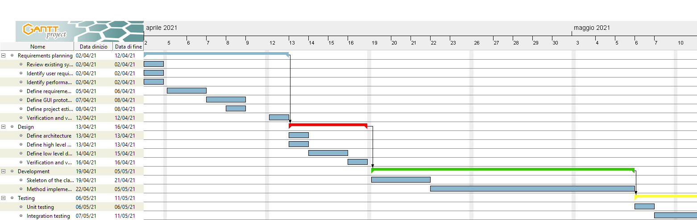

# Project Estimation  
Authors: Martin CAM / Alessio CORVAGLIA / Alessandro IANDOLI / Federico MUSTICH

Date: 23 April 2021

Version: 1.0

# Contents
- [Estimate by product decomposition]
- [Estimate by activity decomposition]

# Estimation approach

# Estimate by product decomposition
### 
|             | Estimate                        |             
| ----------- | ------------------------------- |  
| NC =  Estimated number of classes to be developed   |             12   (?)           |             
|  A = Estimated average size per class, in LOC       |              250 (?)             | 
| S = Estimated size of project, in LOC (= NC * A) | 3000 (?) |
| E = Estimated effort, in person hours (here use productivity 10 LOC per person hour)  |                896                    |   
| C = Estimated cost, in euro (here use 1 person hour cost = 30 euro) | 26880 | 
| Estimated calendar time, in calendar weeks (Assume team of 4 people, 8 hours per day, 5 days per week ) |        6            |

# Estimate by activity decomposition
### 
|         Activity name    | Estimated effort (person hours)   |             
| ----------- | ------------------------------- | 
| **Requirements planning** | **224** |
|   Review existing systems | 8 |
|   Identify user requirements | 16 |
|   Identify performance requirements | 8 |
|   Define requirements document | 64 |
|   Define GUI prototype | 80 |
|   Define project estimation | 16 |
|   Verification and validation of requirements | 32 |
| **Design** | **128** |
|   Define architecture | 12 |
|   Define high level design | 20  |
|   Define low level design | 64 |
|   Verificaton and validation of design | 32 |
| **Development** | **352** |
|   Skeleton of the classes implemetation | 96 |
|   Method implemetation | 256 |
| **Testing** | **192** |
|   Unit testing | 64 |
|   Integration testing | 128 |
### 

# Gantt chart

