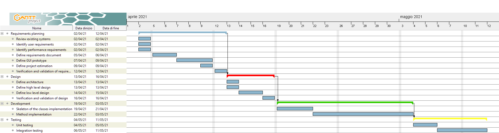

1
2
3
4
5
6
7
8
9
10
11
12
13
14
15
16
17
18
19
20
21
22
23
24
25
26
27
28
29
30
31
32
33
34
35
36
37
38
39
40
41
42
43
44
45
46
47
48
49
50
51
# Project Estimation  
Authors: Martin CAM / Alessio CORVAGLIA / Alessandro IANDOLI / Federico MUSTICH

Date: 23 April 2021

Version: 1.0

# Contents
- [Estimate by product decomposition]
- [Estimate by activity decomposition ]
# Estimation approach

# Estimate by product decomposition
### 
|             | Estimate                        |             
| ----------- | ------------------------------- |  
| NC =  Estimated number of classes to be developed   |             12              |             
|  A = Estimated average size per class, in LOC       |              250              | 
| S = Estimated size of project, in LOC (= NC * A) | 3000 |
| E = Estimated effort, in person hours (here use productivity 10 LOC per person hour)  |                300                    |   
| C = Estimated cost, in euro (here use 1 person hour cost = 30 euro) | 9000 | 
| Estimated calendar time, in calendar weeks (Assume team of 4 people, 8 hours per day, 5 days per week ) |        2            |
# Estimate by activity decomposition
### 
|         Activity name    | Estimated effort (person hours)   |             
| ----------- | ------------------------------- | 
| **Requirements planning** | **40** |
|   Review existing systems | 2 |
|   Identify user requirements | 4 |
|   Identify performance requirements | 2 |
|   Define requirements document | 15 |
|   Define GUI prototype | 10 |
|   Define project estimation | 3 |
|   Verification and validation of requirements | 4 |
| **Design** | **30** |
|   Define architecture | 4 |
|   Define high level design | 5  |
|   Define low level design | 15 |
|   Verificaton and validation of design | 6 |
| **Development** | **180** |
|   Skeleton of the classes implemetation | 30 |
|   Method implemetation | 150 |
| **Testing** | **50** |
|   Unit testing | 20 |
|   Integration testing | 30 |
###               
# Estimate by activity decomposition - ver2
### 
|         Activity name    | Estimated effort (person hours)   |             
| ----------- | ------------------------------- | 
| **Requirements planning** | **160** |   multiplied by 4 previous values
|   Review existing systems | 8 |
|   Identify user requirements | 16 |
|   Identify performance requirements | 8 |
|   Define requirements document | 60 |
|   Define GUI prototype | 40 |
|   Define project estimation | 12 |
|   Verification and validation of requirements | 16 |
| **Design** | **120** | multiplied by 4 previous values
|   Define architecture | 16 |
|   Define high level design | 20  |
|   Define low level design | 60 |
|   Verificaton and validation of design | 24 |
| **Development** | **320** |
|   Skeleton of the classes implemetation | 96 |
|   Method implemetation | 224 |
| **Testing** | **128** |
|   Unit testing | 32 |
|   Integration testing | 96 |
###
Insert here Gantt chart with above activities

