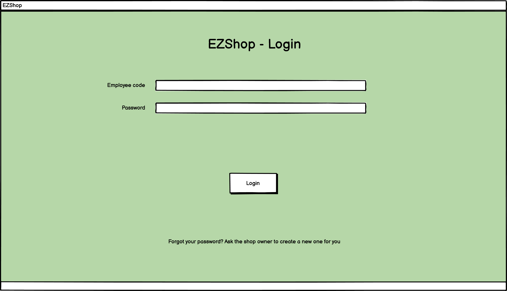
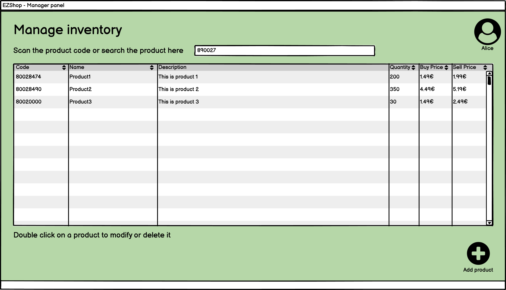

# Graphical User Interface Prototype  

Authors: Martin CAM / Alessio CORVAGLIA / Alessandro IANDOLI / Federico MUSTICH

Date: 16/04/2021

Version: 1.0

*Log In*

*Manager Home*

*Owner Home*

*Log Out / Return to Home*

*New Transaction*

*Transaction*

*Add a new Fidelity Card / Register a Customer*

*Modify or Delete a Fidelity Card*

*Popup before deleting a Fidelity Card*

*List all Fidelity Cards / Customers*

*Add a new product to the Inventory*

*Modify or Delete a product / Modify Quantity*

*Popup before deleting a product*

*List all products*

*Add a new employee*

*Modify or Delete an employee / Upgrade the employee to manager / Get Password if forgotten*

*List all employees*

*Accounting*

*Details of a transaction*
