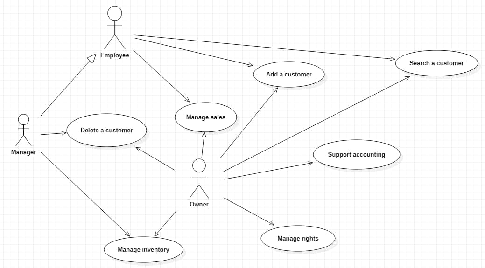
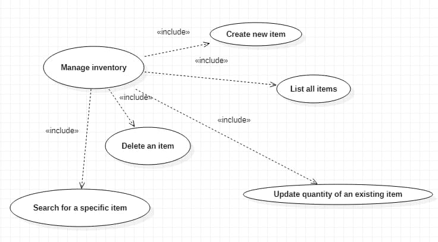
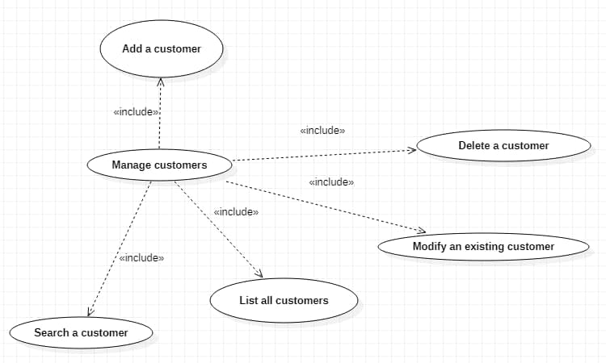
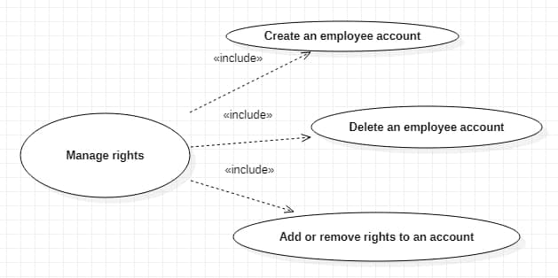

# Requirements Document

Authors: Martin CAM / Alessio CORVAGLIA / Alessandro IANDOLI

Date: 02/04/2021

Version: 1.0

# Contents

- [Essential description](#essential-description)
- [Stakeholders](#stakeholders)
- [Context Diagram and interfaces](#context-diagram-and-interfaces)
	+ [Context Diagram](#context-diagram)
	+ [Interfaces](#interfaces)

- [Stories and personas](#stories-and-personas)
- [Functional and non functional requirements](#functional-and-non-functional-requirements)
	+ [Functional Requirements](#functional-requirements)
	+ [Non functional requirements](#non-functional-requirements)
- [Use case diagram and use cases](#use-case-diagram-and-use-cases)
	+ [Use case diagram](#use-case-diagram)
	+ [Use cases](#use-cases)
    	+ [Relevant scenarios](#relevant-scenarios)
- [Glossary](#glossary)
- [System design](#system-design)
- [Deployment diagram](#deployment-diagram)

# Essential description

Small shops require a simple application to support the owner or manager. A small shop (ex a food shop) occupies 50-200 square meters, sells 500-2000 different item types, has one or a few cash registers
EZShop is a software application to:
* manage sales
* manage inventory
* manage customers
* support accounting

# Stakeholders

| Stakeholder name  | Description |
| ----------------- |:-----------:|
| Owner | Owns the shop |
| Manager | Manages the application, the items in the inventory, and the users in database |
| Employees | Handle sales and can access the inventory |
| Customers | Buy items and may have a fidelity card |
| Maintainers | Ensure the well fonctionnement of the application |
| Suppliers	  | Provide products bought by the owner |

# Context Diagram and interfaces

## Context Diagram

 

## Interfaces

| Actor | Logical Interface | Physical Interface  |
| ------------- |:-------------:| -----:|
| Employees, Manager, Owner | Application GUI | Screen keyboard on PC |

# Stories and personas

David is 48, is the owner of a small shop and decided to use EZShop to manage his inventory.  At the end of the week, he checks the income, the outcome and the trend of the products to get some statistics and anticipate followings orders.

Bob is 50, is an employee of David's shop. Every time that he sells a product to a customer, he handles the transaction on the application. When a customer wants to buy a product, he checks if he has a fidelity card, and asks him if he wants one. If needed, he updates the account of the customer on EZShop.

Alice is 35, is a manager of David's shop. Periodically, she checks the inventory via the application and orders what she might need from the suppliers and update the inventory when she receives it.

# Functional and non functional requirements

## Functional Requirements

| ID        | Description  |
| ------------- |:-------------|
|  FR1     | Manage Sales |
|  FR2     | Manage Inventory  |
|  FR2.1   | Create new item |
|  FR2.2   | Update the quantity of an existing item |
|  FR2.3   | Delete an item |
|  FR2.4   | Decrease the quantity of an item |
|  FR2.5   | List all items available |
|  FR2.6   | Search for a specific item |
|  FR3     | Manage Customers |
|  FR3.1   | Add a customer |
|  FR3.2   | Modify an existing customer |
|  FR3.3   | Delete a customer |
|  FR3.4   | List all customers |
|  FR3.5   | Search a customer |
|  FR4     | Support accounting |
|  FR4.1   | List all transactions |
|  FR4.2   | Search a transaction |
|  FR4.3   | Compute the total of income for a specific period |
|  FR4.4   | List the most and least sold products |
|  FR5     | Manage rights. Authorize access to functions to specific actors according to access rights |
|  FR5.1   | Create an employee account |
|  FR5.2   | Delete an employee account |
|  FR5.3   | Add or remove right to an account |
|  FR6     | Identify Employees |
|  FR6.1   | Log in |
|  FR6.2   | Log out |

### Access rights, Actor vs functions

| Function   | Owner | Manager | Employees |
| ---------- |:-----:|:-------:|:----------:|
| FR1 | yes | yes | yes |
| FR2 | yes | yes | no |
| FR3 | yes | yes | yes |
| FR4 | yes | no | no |
| FR5 | yes | no | no |
| FR6 | yes | yes | yes |

## Non Functional Requirements

| ID        | Type (efficiency, reliability, ..)           | Description  | Refers to |
| ------------- |:-------------:| :----- | -----:|
|  NFR1     | Usability  | Application should be used after a small training of no more than 2 hours for employees and no additional training for manager and owner | All FR |
|  NFR2     | Performance | All functions should complete in < 1sec | FR1, FR2, and FR3 |
|  NFR3     | Portability | The application should be installable on any Operating System (Windows, MacOS, Linux) | All FR |
|  NFR4     | Privacy | The data of customers should not be disclosed | All FR |

# Use case diagram and use cases

## Use case diagram

### Use case 1, UC1 - Manage Sales
| Actors Involved        | Employee |
| ------------- |:-------------:|
|  Precondition     | Employee E is logged in |  
|  Post condition     | Transaction T is added to the database |
|   | Quantity of Item I is reduced |
|  Nominal Scenario     | A customer buy an Item I and Employee E succesfully handle the transaction |
|  Variants     | A customer can buy multiple products and multiple entities of the same product |

##### Scenario 1.1

| Scenario 1.1 | Customer C doesn't have an Account |
| ------------- |:-------------:|
|  Preconditions    | Customer C does not exist |
|  Post conditions     | Quantity of Item I is reduced |
| Step#        | Description  |
|  1     | The Customer C presents the product |  
|  2     | E searchs the Item I |
|  3     | E finds the price of I |
|  4     | C pays the price of I |
|  5     | The quantity of I is reduced |

##### Scenario 1.2

| Scenario 1.2 | Customer C has an Account |
| ------------- |:-------------:|
|  Preconditions    | Customer C exists |
|  Post conditions     | Quantity of Item I is reduced |
|    | Customer C gains points on its fidelity card |
| Step#        | Description  |
|  1     | The Customer C presents the product |  
|  2     | E searchs the Item I |
|  3     | E finds the price of I |
|  4     | C presents the fidelity card |
|  5     | E checks if C exists |
|  6     | C pays the price of I |
|  7     | C gains points on fidelity card |
|  8     | The quantity of I is reduced |

##### Scenario 1.3

| Scenario 1.3 | Customer C has an Account and uses points from his fidelity card |
| ------------- |:-------------:|
|  Preconditions    | Customer C exists |
|    | C has enough points on its fidelity card |
|  Post conditions     | Quantity of Item I is reduced |
|         | Points on fidelity card of C is modified |
| Step#        | Description  |
|  1     | The Customer C presents the product |  
|  2     | E searchs the Item I |
|  3     | E finds the price of I |
|  4     | C presents the fidelity card |
|  5     | E checks if C exists |
|  6     | C uses points from its card |
|  7     | C pays the remaining |
|  8     | C gains points on fidelity card |
|  9     | The quantity of I is reduced |

### Use case 2, UC2 - Create Item
| Actors Involved        | Manager |
| ------------- |:-------------:|
|  Preconditions     | Manager M is logged in |
|    | Item I does not exist |
|  Post condition     | Item I is created |
|  Nominal Scenario     | The Manager M receives an item not registered in the database and add it |

### Use case 3, UC3 - Delete an Item
| Actors Involved        | Manager |
| ------------- |:-------------:|
|  Preconditions     | Manager M is logged in |
|    | Item I exists |
|  Post conditions     | Item I is deleted from the system |
|  Nominal Scenario     | The Manager M wants to delete an Item I because the shop won't sell it anymore |

### Use case 4, UC4 - Search for a specific item
| Actors Involved        | Manager |
| ------------- |:-------------:|
|  Preconditions     | Manager M is logged in |
|  Post conditions     |  |
|  Nominal Scenario     | The Manager M look for an Item I. The Item is found and details about the Item are returned |
|  Variants  | The Manager M look for an Item I. The Item I does not exists in the system and the Manager M is notified |

### Use case 5, UC5 - List all items
| Actors Involved        | Manager |
| ------------- |:-------------:|
|  Preconditions     | Manager M is logged in |
|  Post conditions     |  |
|  Nominal Scenario     | The list of Items is returned. |
|  Variants   |  The list is empty and the Manager M is notified |

### Use case 6, UC6 - Update quantity of an existing item
| Actors Involved        | Manager |
| ------------- |:-------------:|
|  Preconditions     | Manager M is logged in |
|    | Item I exists |
|  Post conditions     | The quantity of the Item I is modified |
|  Nominal Scenario     | The Manager M receives new entities of the Item I and add them in the system |

### Use case 7, UC7 - Add a customer
| Actors Involved        | Employee |
| ------------- |:-------------:|
|  Preconditions     | Employee E is logged in |
|    | Customer C does not exist |
|  Post conditions     | Customer C is created |
|     | Customer C receives a fidelity card |
|  Nominal Scenario     | A Customer C wants to get a fidelity card and ask the Employee E to create an account |

### Use case 8, UC8 - Modify an existing customer  
| Actors Involved        | Employee |
| ------------- |:-------------:|
|  Preconditions     | Employee E is logged in |
|    | Customer C exists |
|  Post conditions     | Customer C is modified |
|  Nominal Scenario     | A Customer C wants to modify informations about him (like its adress, phone number) / use points from fidelity card |

### Use case 9, UC9 - Delete a customer
| Actors Involved        | Manager |
| ------------- |:-------------:|
|  Preconditions     | Manager M is logged in |
|    | Customer C exists |
|  Post conditions     | Customer C is deleted from the system |
|  Nominal Scenario     | A Customer C wants to give up its fidelity card and its account in the shop |

### Use case 10, UC10 - List all customers
| Actors Involved        | Employee |
| ------------- |:-------------:|
|  Preconditions     | Employee E is logged in |
|  Post conditions     |  |
|  Nominal Scenario     | The list of Customers is returned. |
|  Variants   |  The list is empty and the Employee E is notified |

### Use case 11, UC11 - Search a Customer
| Actors Involved        | Employee |
| ------------- |:-------------:|
|  Preconditions     | Employee E is logged in |
|  Post conditions     |  |
|  Nominal Scenario     | The Employee E look for an Customer C. The Customer is found and details about the Customer are returned |
|  Variants  | The Employee E look for an Customer C. The Customer C does not exists in the system and the Employee E is notified |

### Use case 12, UC12 - Support Accounting
| Actors Involved        | Owner |
| ------------- |:-------------:|
|  Preconditions     | Owner O is logged in |
|  Post conditions     |  |
|  Nominal Scenario     | A variety of statistics and informations are displayed to the Owner O. |

### Use case 13, UC13 - Create an Employee Account
| Actors Involved        | Owner |
| ------------- |:-------------:|
|  Preconditions     | Owner O is logged in |
|    | Employee E does not exists |
|  Post conditions     | Employee E is created |
|  Nominal Scenario     | A new Employee E is hired and the Owner O creates its account and give the credentials to the Employee E |

### Use case 14, UC14 - Delete an Employee Account
| Actors Involved        | Owner |
| ------------- |:-------------:|
|  Preconditions     | Owner O is logged in |
|    | Employee E exists |
|  Post conditions     | Employee E is deleted from the system |
|  Nominal Scenario     | An Employee leaves the shop and the Owner O deletes its account |

### Use case 15, UC15 - Add or remove rights
| Actors Involved        | Owner |
| ------------- |:-------------:|
|  Preconditions     | Owner O is logged in |
|    | Employee E exists |
|  Post conditions     | The rights of Employee E are modified |
|  Nominal Scenario     | An Employee E becomes a Manager M or a Manager M becomes an Employee E and the Owner O makes the modification in the system |

### Use case 16, UC16 - Log In
| Actors Involved     | Employee |
| ------------- |:------------:|
| Preconditions   | Employee E has an account |
| Post conditions | Employees E is logged in |
| Nominal Scenario   | An Employee E uses its credentials and the database match them with the right account |

### use case 17, UC17 - Log out
| Actors Involved     | Employee |
| ------------- |:------------:|
| Preconditions   | Employee E is logged in |
| Post conditions | Employees E is not logged in |
| Nominal Scenario   | An Employee E asks to be disconnected and the system disconnects him |

# Glossary

\<use UML class diagram to define important terms, or concepts in the domain of the system, and their relationships>

\<concepts are used consistently all over the document, ex in use cases, requirements etc>

# System Design
\<describe here system design>

\<must be consistent with Context diagram>

# Deployment Diagram

\<describe here deployment diagram >
