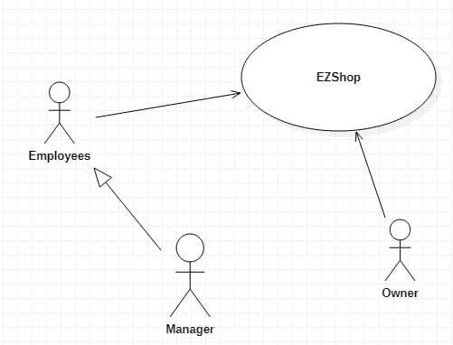

# Requirements Document

Authors: Martin CAM / Alessio CORVAGLIA / Alessandro IANDOLI

Date: 02/04/2021

Version: 1.0

# Contents

- [Essential description](#essential-description)
- [Stakeholders](#stakeholders)
- [Context Diagram and interfaces](#context-diagram-and-interfaces)
	+ [Context Diagram](#context-diagram)
	+ [Interfaces](#interfaces)

- [Stories and personas](#stories-and-personas)
- [Functional and non functional requirements](#functional-and-non-functional-requirements)
	+ [Functional Requirements](#functional-requirements)
	+ [Non functional requirements](#non-functional-requirements)
- [Use case diagram and use cases](#use-case-diagram-and-use-cases)
	+ [Use case diagram](#use-case-diagram)
	+ [Use cases](#use-cases)
    	+ [Relevant scenarios](#relevant-scenarios)
- [Glossary](#glossary)
- [System design](#system-design)
- [Deployment diagram](#deployment-diagram)

# Essential description

Small shops require a simple application to support the owner or manager. A small shop (ex a food shop) occupies 50-200 square meters, sells 500-2000 different item types, has one or a few cash registers
EZShop is a software application to:
* manage sales
* manage inventory
* manage customers
* support accounting

# Stakeholders

| Stakeholder name  | Description |
| ----------------- |:-----------:|
| Owner | Owns the shop |
| Manager | Manages the application, the items in the inventory, and the users in database |
| Employees | Handle sales and can access the inventory |
| Customers | Buy items and may have a fidelity card |
| Maintainers | Ensure the well fonctionnement of the application |
| Suppliers	  | Provide products bought by the owner |

# Context Diagram and interfaces

## Context Diagram

 

## Interfaces

| Actor | Logical Interface | Physical Interface  |
| ------------- |:-------------:| -----:|
| Employees, Manager, Owner | Application GUI | Screen keyboard on PC |

# Stories and personas

David is 48, is the owner of a small shop and decided to use EZShop to manage his inventory.  At the end of the week, he checks the income, the outcome and the trend of the products to get some statistics and anticipate followings orders.

Bob is 50, is an employee of David's shop. Every time that he sells a product to a customer, he handles the transaction on the application. When a customer wants to buy a product, he checks if he has a fidelity card, and asks him if he wants one. If needed, he updates the account of the customer on EZShop.

Alice is 35, is a manager of David's shop. Periodically, she checks the inventory via the application and orders what she might need from the suppliers and update the inventory when she receives it.

# Functional and non functional requirements

## Functional Requirements

| ID        | Description  |
| ------------- |:-------------|
|  FR1     | Manage Sales |
|  FR1.1   | Start transaction |
|  FR1.2   | Store the transaction details in a database |
|  FR1.3   | End the transaction |
|  FR2     | Manage Inventory  |
|  FR2.1   | Create new item, update the quantity of an existing item |
|  FR2.2   | Decrease the quantity of an item |
|  FR2.3   | List all items available |
|  FR2.4   | Search for a specific item |
|  FR3     | Manage Customers |
|  FR3.1   | Add a customer, modify an existing customer |
|  FR3.2   | Delete a customer |
|  FR3.3   | List all customers |
|  FR3.4   | Search a customer |
|  FR4     | Support accounting |
|  FR4.1   | List all transactions |
|  FR4.2   | Search a transaction |
|  FR4.3   | Compute the total of income for a specific period |
|  FR4.4   | List the most and least sold products |
|  FR5     | Manage rights. Authorize access to functions to specific actors according to access rights |

### Access rigth, Actor vs functions

| Function   | Owner | Manager | Employees |
| ---------- |:-----:|:-------:|:----------:|
| FR1 | yes | yes | yes |
| FR2 | yes | yes | no |
| FR3.1 | yes | yes | yes |
| FR3.2 | yes | yes | no |
| FR3.3 | yes | yes | no |
| FR3.4 | yes | yes | yes |
| FR4 | yes | no | no |
| FR5 | yes | no | no |

## Non Functional Requirements

\<Describe constraints on functional requirements>

| ID        | Type (efficiency, reliability, ..)           | Description  | Refers to |
| ------------- |:-------------:| :----- | -----:|
|  NFR1     | Usability  | Application should be used after a small training of no more than 2 hours for employees and no additional training for manager and owner | All FR |
|  NFR2     | Performance | All functions should complete in < 1sec | FR1, FR2, and FR3 |
|  NFR3     | Portability | The application should be installable on any Operating System (Windows, MacOS, Linux) | All FR |
|  NFR4     | Privacy | The data of customers should not be disclosed | All FR |

# Use case diagram and use cases

## Use case diagram
\<define here UML Use case diagram UCD summarizing all use cases, and their relationships>

\<next describe here each use case in the UCD>
### Use case 1, UC1
| Actors Involved        |  |
| ------------- |:-------------:|
|  Precondition     | \<Boolean expression, must evaluate to true before the UC can start> |  
|  Post condition     | \<Boolean expression, must evaluate to true after UC is finished> |
|  Nominal Scenario     | \<Textual description of actions executed by the UC> |
|  Variants     | \<other executions, ex in case of errors> |

##### Scenario 1.1

\<describe here scenarios instances of UC1>

\<a scenario is a sequence of steps that corresponds to a particular execution of one use case>

\<a scenario is a more formal description of a story>

\<only relevant scenarios should be described>

| Scenario 1.1 | |
| ------------- |:-------------:|
|  Precondition     | \<Boolean expression, must evaluate to true before the scenario can start> |
|  Post condition     | \<Boolean expression, must evaluate to true after scenario is finished> |
| Step#        | Description  |
|  1     |  |  
|  2     |  |
|  ...     |  |

##### Scenario 1.2

##### Scenario 1.x

### Use case 2, UC2
..

### Use case x, UCx
..

# Glossary

\<use UML class diagram to define important terms, or concepts in the domain of the system, and their relationships>

\<concepts are used consistently all over the document, ex in use cases, requirements etc>

# System Design
\<describe here system design>

\<must be consistent with Context diagram>

# Deployment Diagram

\<describe here deployment diagram >
