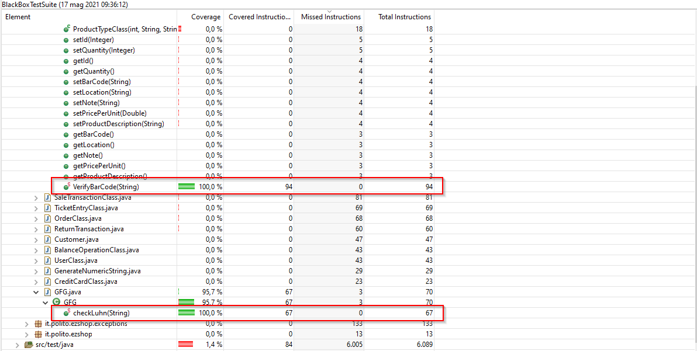

# Unit Testing Documentation

Authors: Martin CAM / Alessio CORVAGLIA / Alessandro IANDOLI / Federico MUSTICH

Date: 12 May 2021

Version: 1.0

# Contents

- [Black Box Unit Tests](#black-box-unit-tests)

- [White Box Unit Tests](#white-box-unit-tests)

# Black Box Unit Tests

    <Define here criteria, predicates and the combination of predicates for each function of each class.
    Define test cases to cover all equivalence classes and boundary conditions.
    In the table, report the description of the black box test case and (traceability) the correspondence with the JUnit test case writing the 
    class and method name that contains the test case>
    <JUnit test classes must be in src/test/java/it/polito/ezshop   You find here, and you can use,  class TestEzShops.java that is executed  
    to start tests
    >

### **Class *className* - method *methodName()***

**Criteria for method *methodName()*:**
	
 - any input 

**Predicates for method *methodName()*:**

| Criteria | Predicate |
| -------- | --------- |
|   any input       |    arbitrary values       |

**Boundaries**:

No boundaries

**Combination of predicates**:

| Criteria 1 | Valid / Invalid | Description of the test case | JUnit test case |
|-------|-------|-------|-------|
|any input |Valid | setMethodName(fill_it) -> getMethodName()==fill_it | testUnitMethods.testXYZWClass() |

 ### **Class *GFG* - method *checkLuhn***

**Criteria for method *checkLuhn()*:**
	
 - validity of input string

**Predicates for method *checkLuhn()*:**

| Criteria | Predicate |
| -------- | --------- |
|     validity of input string     |     valid string      |
|          |       invalid string     |
|          |      NULL     |

**Boundaries**:

No boundaries

**Combination of predicates**:

| Criteria 1  | Valid / Invalid | Description of the test case | JUnit test case |
|-------|-------|-------|-------|
|valid string | valid|T1("4485370086510891")->true|verifyCheckLuhn.testValidStrings()|
|invalid string| valid|T2("448537invalid0891")->false|verifyCheckLuhn.testInvalidStrings() |
|NULL| valid|T3(NULL)->false|verifyCheckLuhn.testNull() |

 ### **Class *ProductTypeClass* - method *VerifyBarCode()***

**Criteria for method *VerifyBarCode()*:**
	

 - Validity of input String

**Predicates for method *VerifyBarCode()*:**

| Criteria | Predicate |
| -------- | --------- |
|  Validity of input String  |    Valid String    |
|          |    Invalid String       |
|          |    Null       |

**Boundaries**:

No boundaries

**Combination of predicates**:

| Criteria 1 | Valid / Invalid | Description of the test case | JUnit test case |
|-------|-------|-------|-------|
| Valid String | Valid | T1("0628176957012") -> True | verifyBarCode.verifyTrueString() |
| Invalid String | Valid | T2("1111111111") -> False | verifyBarCode.verifyFalseString() |
| Null | Valid | T3(null) -> False | verifyBarCode.verifyNull() |

### **Class *BalanceOperationClass* - method *balanceOperationClass()***

**Criteria for method *balanceOperationClass()*:**
	
 - any input 

**Predicates for method *balanceOperationClass()*:**

| Criteria | Predicate |
| -------- | --------- |
|   any input       |    arbitrary values       |

**Boundaries**:

No boundaries

**Combination of predicates**:

| Criteria 1 | Valid / Invalid | Description of the test case | JUnit test case |
|-------|-------|-------|-------|
|any input |Valid | balanceOperationClass(balanceId, date, money, type) -> b.getBalanceId()==balanceId, b.getDate()==date, b.getMoney()==money, b.getType()==type | testUnitMethods.testBalanceOperationClass() |

### **Class *BalanceOperationClass* - method *setBalanceId***

**Criteria for method *setBalanceId()*:**
	
 - any input 

**Predicates for method *setBalanceId()*:**

| Criteria | Predicate |
| -------- | --------- |
|   any input       |    arbitrary values       |

**Boundaries**:

No boundaries

**Combination of predicates**:

| Criteria 1 | Valid / Invalid | Description of the test case | JUnit test case |
|-------|-------|-------|-------|
|any input |Valid | setBalanceId(1) -> getBalanceId()==1 | testUnitMethods.testBalanceOperationClass() |

### **Class *OrderClass* - method *orderClass()***

**Criteria for method *orderClass()*:**
	
 - any input 

**Predicates for method *orderClass()*:**

| Criteria | Predicate |
| -------- | --------- |
|   any input       |    arbitrary values       |

**Boundaries**:

No boundaries

**Combination of predicates**:

| Criteria 1 | Valid / Invalid | Description of the test case | JUnit test case |
|-------|-------|-------|-------|
|any input |Valid | orderClass(orderId, balanceId, productCode, pricePerUnit, quantity, status) -> o.getOrderId()==orderId, o.getBalanceId()==balanceId, o.getProductCode()==productCode, o.getPricePerUnit()==pricePerUnit, o.getQuantity()==quantity, o.getStatus()==status | testUnitMethods.testOrderClass() |

### **Class *OrderClass* - method *setBalanceId()***

**Criteria for method *setBalanceId()*:**
	
 - any input 

**Predicates for method *setBalanceId()*:**

| Criteria | Predicate |
| -------- | --------- |
|   any input       |    arbitrary values       |

**Boundaries**:

No boundaries

**Combination of predicates**:

| Criteria 1 | Valid / Invalid | Description of the test case | JUnit test case |
|-------|-------|-------|-------|
|any input |Valid | setBalanceId(1) -> getBalanceId()==1 | testUnitMethods.testOrderClass() |

### **Class *OrderClass* - method *productCode()***

**Criteria for method *productCode()*:**
	
 - any input 

**Predicates for method *productCode()*:**

| Criteria | Predicate |
| -------- | --------- |
|   any input       |    arbitrary values       |

**Boundaries**:

No boundaries

**Combination of predicates**:

| Criteria 1 | Valid / Invalid | Description of the test case | JUnit test case |
|-------|-------|-------|-------|
|any input |Valid | setProductCode("productCode") -> getProductCode()=="productCode" | testUnitMethods.testOrderClass() |

### **Class *OrderClass* - method *setPricePerUnit()***

**Criteria for method *setPricePerUnit()*:**
	
 - any input 

**Predicates for method *setPricePerUnit()*:**

| Criteria | Predicate |
| -------- | --------- |
|   any input       |    arbitrary values       |

**Boundaries**:

No boundaries

**Combination of predicates**:

| Criteria 1 | Valid / Invalid | Description of the test case | JUnit test case |
|-------|-------|-------|-------|
|any input |Valid | setPricePerUnit(2.00) -> getPricePerUnit()==2.00 | testUnitMethods.testOrderClass() |

### **Class *OrderClass* - method *setQuantity()***

**Criteria for method *setQuantity()*:**
	
 - any input 

**Predicates for method *setQuantity()*:**

| Criteria | Predicate |
| -------- | --------- |
|   any input       |    arbitrary values       |

**Boundaries**:

No boundaries

**Combination of predicates**:

| Criteria 1 | Valid / Invalid | Description of the test case | JUnit test case |
|-------|-------|-------|-------|
|any input |Valid | setQuantity(5) -> getQuantity()==5 | testUnitMethods.testOrderClass() |

### **Class *OrderClass* - method *setStatus()***

**Criteria for method *setStatus()*:**
	
 - any input 

**Predicates for method *setStatus()*:**

| Criteria | Predicate |
| -------- | --------- |
|   any input       |    arbitrary values       |

**Boundaries**:

No boundaries

**Combination of predicates**:

| Criteria 1 | Valid / Invalid | Description of the test case | JUnit test case |
|-------|-------|-------|-------|
|any input |Valid | setStatus("ORDERED") -> getStatus()=="ORDERED" | testUnitMethods.testOrderClass() |

### **Class *OrderClass* - method *setOrderId()***

**Criteria for method *setOrderId()*:**
	
 - any input 

**Predicates for method *setOrderId()*:**

| Criteria | Predicate |
| -------- | --------- |
|   any input       |    arbitrary values       |

**Boundaries**:

No boundaries

**Combination of predicates**:

| Criteria 1 | Valid / Invalid | Description of the test case | JUnit test case |
|-------|-------|-------|-------|
|any input |Valid | setOrderId(5) -> getOrderId()==5 | testUnitMethods.testOrderClass() |

### **Class *ProductType* - method *productType()***

**Criteria for method *productType()*:**
	
 - any input 

**Predicates for method *productType()*:**

| Criteria | Predicate |
| -------- | --------- |
|   any input       |    arbitrary values       |

**Boundaries**:

No boundaries

**Combination of predicates**:

| Criteria 1 | Valid / Invalid | Description of the test case | JUnit test case |
|-------|-------|-------|-------|
|any input |Valid | productType(description, barcode, pricePerUnit, note, id) -> p.getProductDescription()==description, p.getBarCode()==barcode, p.getPricePerUnit()==pricePerUnit, p.getNote()==note, p.getId()==id | testUnitMethods.testProductTypeClass() |

### **Class *ProductTypeClass* - method *setQuantity()***

**Criteria for method *setQuantity()*:**
	
 - any input 

**Predicates for method *setQuantity()*:**

| Criteria | Predicate |
| -------- | --------- |
|   any input       |    arbitrary values       |

**Boundaries**:

No boundaries

**Combination of predicates**:

| Criteria 1 | Valid / Invalid | Description of the test case | JUnit test case |
|-------|-------|-------|-------|
|any input |Valid | setQuantity(1) -> getQuantity()==1 | testUnitMethods.testProductTypeClass() |

### **Class *ProductTypeClass* - method *setLocation()***

**Criteria for method *setLocation()*:**
	
 - any input 

**Predicates for method *setLocation()*:**

| Criteria | Predicate |
| -------- | --------- |
|   any input       |    arbitrary values       |

**Boundaries**:

No boundaries

**Combination of predicates**:

| Criteria 1 | Valid / Invalid | Description of the test case | JUnit test case |
|-------|-------|-------|-------|
|any input |Valid | setLocation("location") -> getLocation()=="location" | testUnitMethods.testProductTypeClass() |

### **Class *ProductTypeClass* - method *setNote()***

**Criteria for method *setNote()*:**
	
 - any input 

**Predicates for method *setNote()*:**

| Criteria | Predicate |
| -------- | --------- |
|   any input       |    arbitrary values       |

**Boundaries**:

No boundaries

**Combination of predicates**:

| Criteria 1 | Valid / Invalid | Description of the test case | JUnit test case |
|-------|-------|-------|-------|
|any input |Valid | setNote("note") -> getNote()=="note" | testUnitMethods.testProductTypeClass() |

### **Class *ProductTypeClass* - method *setProductDescription()***

**Criteria for method *setProductDescription()*:**
	
 - any input 

**Predicates for method *setProductDescription()*:**

| Criteria | Predicate |
| -------- | --------- |
|   any input       |    arbitrary values       |

**Boundaries**:

No boundaries

**Combination of predicates**:

| Criteria 1 | Valid / Invalid | Description of the test case | JUnit test case |
|-------|-------|-------|-------|
|any input |Valid | setProductDescription("description") -> getProductDescription()=="description" | testUnitMethods.testProductTypeClass() |

### **Class *ProductTypeClass* - method *setBarCode()***

**Criteria for method *setBarCode()*:**
	
 - any input 

**Predicates for method *setBarCode()*:**

| Criteria | Predicate |
| -------- | --------- |
|   any input       |    arbitrary values       |

**Boundaries**:

No boundaries

**Combination of predicates**:

| Criteria 1 | Valid / Invalid | Description of the test case | JUnit test case |
|-------|-------|-------|-------|
|any input |Valid | setBarCode("barcode") -> getBarCode()=="barcode" | testUnitMethods.testProductTypeClass() |

### **Class *ProductTypeClass* - method *setPricePerUnit()***

**Criteria for method *setPricePerUnit()*:**
	
 - any input 

**Predicates for method *setPricePerUnit()*:**

| Criteria | Predicate |
| -------- | --------- |
|   any input       |    arbitrary values       |

**Boundaries**:

No boundaries

**Combination of predicates**:

| Criteria 1 | Valid / Invalid | Description of the test case | JUnit test case |
|-------|-------|-------|-------|
|any input |Valid | setPricePerUnit(1) -> getPricePerUnit()==1 | testUnitMethods.testProductTypeClass() |

### **Class *ProductTypeClass* - method *setId()***

**Criteria for method *setId()*:**
	
 - any input 

**Predicates for method *setId()*:**

| Criteria | Predicate |
| -------- | --------- |
|   any input       |    arbitrary values       |

**Boundaries**:

No boundaries

**Combination of predicates**:

| Criteria 1 | Valid / Invalid | Description of the test case | JUnit test case |
|-------|-------|-------|-------|
|any input |Valid | setId(1) -> getId()==1 | testUnitMethods.testProductTypeClass() |

### **Class *TicketEntryClass* - method *TicketEntryClass()***

**Criteria for method *ticketEntryClass()*:**
	
 - any input 

**Predicates for method *ticketEntryClass()*:**

| Criteria | Predicate |
| -------- | --------- |
|   any input       |    arbitrary values       |

**Boundaries**:

No boundaries

**Combination of predicates**:

| Criteria 1 | Valid / Invalid | Description of the test case | JUnit test case |
|-------|-------|-------|-------|
|any input |Valid | ticketEntryClass(transactionid, barcode, description, amount, pricePerUnit, discount) -> t.getTransactionId()==transactionid, t.getBarCode()==barcode, t.getProductDescription()==description, t.getAmount()==amount, t.getPricePerUnit()==pricePerUnit, t.getDiscountRate()==discount | testUnitMethods.testTicketEntryClass() |

### **Class *TicketEntryClass* - method *setTransactionId()***

**Criteria for method *setTransactionId()*:**

- any input 

**Predicates for method *setTransactionId()*:**
| Criteria | Predicate |
| -------- | --------- |
|   any input       |    arbitrary values       |

**Combination of predicates**:

| Criteria 1 | Valid / Invalid | Description of the test case | JUnit test case |
|-------|-------|-------|-------|
|any input |Valid | setTransactionId(2) -> getTransactionId()==2 | testUnitMethods.testTicketEntryClass() |

### **Class *TicketEntryClass* - method *setBarCode()***

**Criteria for method *setBarCode()*:**
	
 - any input 

**Predicates for method *setBarCode()*:**

| Criteria | Predicate |
| -------- | --------- |
|   any input       |    arbitrary values       |

**Boundaries**:

No boundaries

**Combination of predicates**:

| Criteria 1 | Valid / Invalid | Description of the test case | JUnit test case |
|-------|-------|-------|-------|
|any input |Valid | setBarCode("0628176957012") -> getBarCode()=="0628176957012" | testUnitMethods.testTicketEntryClass() |

### **Class *TicketEntryClass* - method *setProductDescription()***

**Criteria for method *setProductDescription()*:**
	
 - any input 

**Predicates for method *setProductDescription()*:**

| Criteria | Predicate |
| -------- | --------- |
|   any input       |    arbitrary values       |

**Boundaries**:

No boundaries

**Combination of predicates**:

| Criteria 1 | Valid / Invalid | Description of the test case | JUnit test case |
|-------|-------|-------|-------|
|any input |Valid | setProductDescription("kiwi") -> getProductDescription()=="kiwi" | testUnitMethods.testTicketEntryClass() |

### **Class *TicketEntryClass* - method *setPricePerUnit()***

**Criteria for method *setPricePerUnit()*:**
	
 - any input 

**Predicates for method *setPricePerUnit()*:**

| Criteria | Predicate |
| -------- | --------- |
|   any input       |    arbitrary values       |

**Boundaries**:

No boundaries

**Combination of predicates**:

| Criteria 1 | Valid / Invalid | Description of the test case | JUnit test case |
|-------|-------|-------|-------|
|any input |Valid | setPricePerUnit(0.9) -> getPricePerUnit()==0.9 | testUnitMethods.testTicketEntryClass() |

### **Class *TicketEntryClass* - method *setAmount()***

**Criteria for method *setAmount()*:**
	
 - any input 

**Predicates for method *setAmount()*:**

| Criteria | Predicate |
| -------- | --------- |
|   any input       |    arbitrary values       |

**Boundaries**:

No boundaries

**Combination of predicates**:

| Criteria 1 | Valid / Invalid | Description of the test case | JUnit test case |
|-------|-------|-------|-------|
|any input |Valid | setAmount(4) -> getAmount()==4 | testUnitMethods.testTicketEntryClass() |

### **Class *TicketEntryClass* - method *setDiscountRate()***

**Criteria for method *setDiscountRate()*:**
	
 - any input 

**Predicates for method *setDiscountRate()*:**

| Criteria | Predicate |
| -------- | --------- |
|   any input       |    arbitrary values       |

**Boundaries**:

No boundaries

**Combination of predicates**:

| Criteria 1 | Valid / Invalid | Description of the test case | JUnit test case |
|-------|-------|-------|-------|
|any input |Valid | setDiscountRate(0.5) -> getDiscountRate()==0.5 | testUnitMethods.testTicketEntryClass() |

### **Class *UserClass* - method *userClass()***

**Criteria for method *userClass()*:**
	
 - any input 

**Predicates for method *userClass()*:**

| Criteria | Predicate |
| -------- | --------- |
|   any input       |    arbitrary values       |

**Boundaries**:

No boundaries

**Combination of predicates**:

| Criteria 1 | Valid / Invalid | Description of the test case | JUnit test case |
|-------|-------|-------|-------|
|any input |Valid | userClass(id, username, password, role) -> u.getId()==id, u.getUsername()==username, u.getPassword()==password, u.getRole()==role | testUnitMethods.testUserClass() |

### **Class *UserClass* - method *setId()***

**Criteria for method *setId()*:**
	
 - any input 

**Predicates for method *setId()*:**

| Criteria | Predicate |
| -------- | --------- |
|   any input       |    arbitrary values       |

**Boundaries**:

No boundaries

**Combination of predicates**:

| Criteria 1 | Valid / Invalid | Description of the test case | JUnit test case |
|-------|-------|-------|-------|
|any input |Valid | setId(2) -> getId()==2 | testUnitMethods.testUserClass() |

### **Class *UserClass* - method *setUsername()***

**Criteria for method *setUsername()*:**
	
 - any input 

**Predicates for method *setUsername()*:**

| Criteria | Predicate |
| -------- | --------- |
|   any input       |    arbitrary values       |

**Boundaries**:

No boundaries

**Combination of predicates**:

| Criteria 1 | Valid / Invalid | Description of the test case | JUnit test case |
|-------|-------|-------|-------|
|any input |Valid | setUsername("username2") -> getUsername()=="username2" | testUnitMethods.testUserClass() |

### **Class *UserClass* - method *setPassword()***

**Criteria for method *setPassword()*:**
	
 - any input 

**Predicates for method *setPassword()*:**

| Criteria | Predicate |
| -------- | --------- |
|   any input       |    arbitrary values       |

**Boundaries**:

No boundaries

**Combination of predicates**:

| Criteria 1 | Valid / Invalid | Description of the test case | JUnit test case |
|-------|-------|-------|-------|
|any input |Valid | setPassword("pwd2") -> getPassword()=="pwd2" | testUnitMethods.testUserClass() |

### **Class *UserClass* - method *setRole()***

**Criteria for method *setRole()*:**
	
 - any input 

**Predicates for method *setRole()*:**

| Criteria | Predicate |
| -------- | --------- |
|   any input       |    arbitrary values       |

**Boundaries**:

No boundaries

**Combination of predicates**:

| Criteria 1 | Valid / Invalid | Description of the test case | JUnit test case |
|-------|-------|-------|-------|
|any input |Valid | setRole("Cashier") -> getRole()=="Cashier" | testUnitMethods.testUserClass() |

### **Class *SaleTransactionClass* - method *saleTransactionClass()***

**Criteria for method *saleTransactionClass()*:**
	
 - any input 

**Predicates for method *saleTransactionClass()*:**

| Criteria | Predicate |
| -------- | --------- |
|   any input       |    arbitrary values       |

**Boundaries**:

No boundaries

**Combination of predicates**:

| Criteria 1 | Valid / Invalid | Description of the test case | JUnit test case |
|-------|-------|-------|-------|
|any input |Valid | saleTransactionClass(number, price, discount, entries, state) -> s.getTicketNumber()==number, s.getPrice()==price, s.getDiscountRate()==discount, s.getEntries()==entries, s.getState()==state | testUnitMethods.testSaleTransactionClass() |

### **Class *ReturnTransaction* - method *returnTransaction()***

**Criteria for method *returnTransaction()*:**
	
 - any input 

**Predicates for method *returnTransaction()*:**

| Criteria | Predicate |
| -------- | --------- |
|   any input       |    arbitrary values       |

**Boundaries**:

No boundaries

**Combination of predicates**:

| Criteria 1 | Valid / Invalid | Description of the test case | JUnit test case |
|-------|-------|-------|-------|
|any input |Valid | returnTransaction(id, saleid, products, status) -> r.getId()==id, r.getSaleTransactionId()==saleid, r.getProducts()==products, r.getStatus()==status | testUnitMethods.testReturnTransactionClass() |

### **Class *CustomerClass* - method *customerClass()***

**Criteria for method *customerClass()*:**
	
 - any input 

**Predicates for method *customerClass()*:**

| Criteria | Predicate |
| -------- | --------- |
|   any input       |    arbitrary values       |

**Boundaries**:

No boundaries

**Combination of predicates**:

| Criteria 1 | Valid / Invalid | Description of the test case | JUnit test case |
|-------|-------|-------|-------|
|any input |Valid | customerClass(id, name, card, points) -> c.getCustomerId()==id, c.getCustomerName()==name, c.getCustomerCard()==card, c.getPoints()==points | testUnitMethods.testCustomerClass() |

### **Class *CreditCardClass* - method *creditCardClass()***

**Criteria for method *creditCardClass()*:**
	
 - any input 

**Predicates for method *creditCardClass()*:**

| Criteria | Predicate |
| -------- | --------- |
|   any input       |    arbitrary values       |

**Boundaries**:

No boundaries

**Combination of predicates**:

| Criteria 1 | Valid / Invalid | Description of the test case | JUnit test case |
|-------|-------|-------|-------|
|any input |Valid | creditCardClass(number, balance) -> c.getCreditCardId()==number, c.getBalance()==balance | testUnitMethods.testCreditCardClass() |

# White Box Unit Tests

### Test cases definition
    
    <JUnit test classes must be in src/test/java/it/polito/ezshop>
    <Report here all the created JUnit test cases, and the units/classes under test >
    <For traceability write the class and method name that contains the test case>

**No additional WB tests defined since coverage of all leaf classes is over 90%**

| Unit name | JUnit test case |
|--|--|
|||
|||
||||

### Code coverage report

    <Add here the screenshot report of the statement and branch coverage obtained using
    the Eclemma tool. >

### Loop coverage analysis

    <Identify significant loops in the units and reports the test cases
    developed to cover zero, one or multiple iterations >

**The following loop-tests come out automatically from BB tests previously definied**

|Unit name | Loop rows | Number of iterations | JUnit test case |
|---|---|---|---|
|ProductTypeClass|47-59|0, >1|VerifyBarCodeTest.verifyFalseString(), VerifyBarCodeTest.verifyTrueString()|
|GFG|26-43|0,1,>1|checkLuhnTest.testInvalidStrings(), checkLuhnTest.testValidStrings()|
